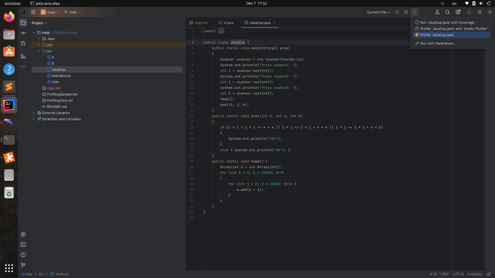
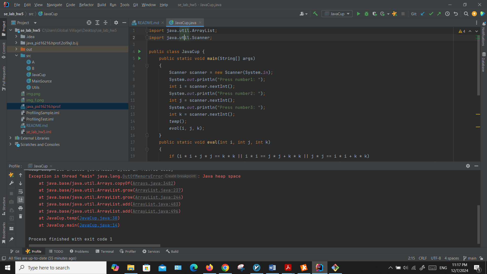
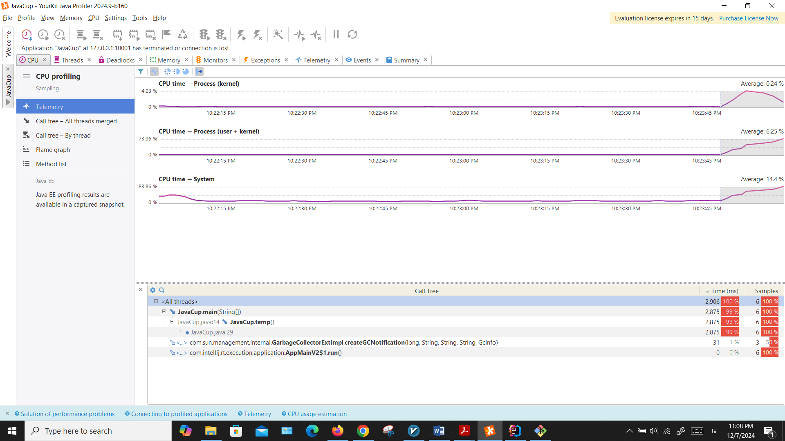
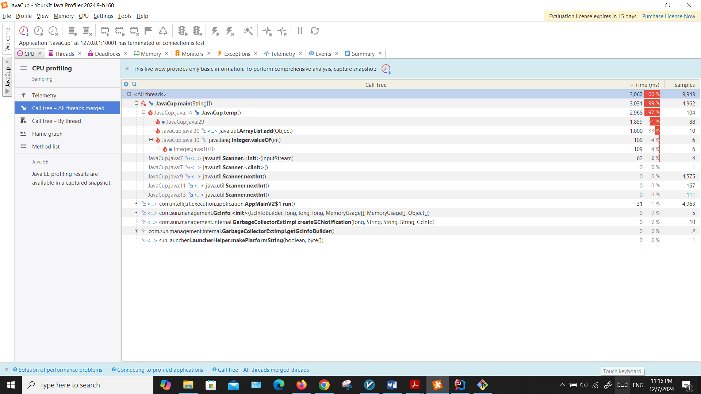
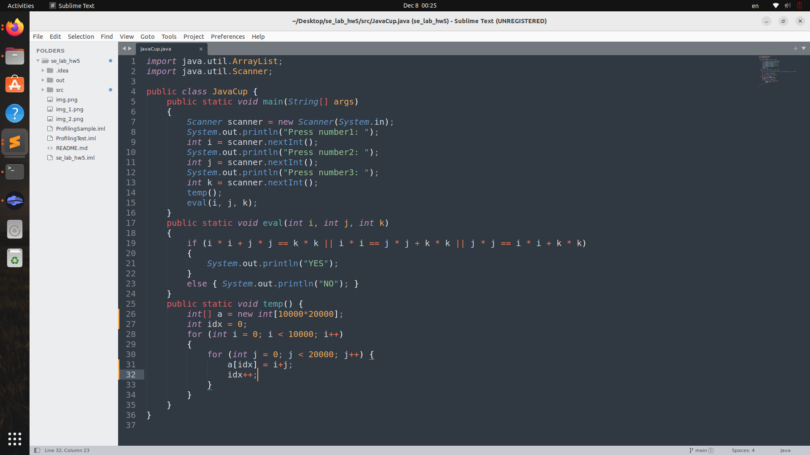

# se_lab_hw5
ابتدا با yourkit پروفایل برنامه را تحلیل می کنیم:

مشاهده میکنیم که نه تنها بخش temp حافظه و زمان اجرای بالایی دارد بلکه میزان بالای مصرف حافظه آن سبب کرش کردن برنامه نیز می شود. 

برای رفع این مشکل کافیست که ArrayList را با یک آرایه ساده جایگزین کنیم چرا که هم سایز آرایه از قبل مشخص است هم ArrayList حجم بیشتری نسبت به آرایه ساده می برد هم عملیات add به ArrayList عملیاتی زمان بر است:
