# se_lab_hw5

ابتدا با yourkit پروفایل برنامه را تحلیل می کنیم:
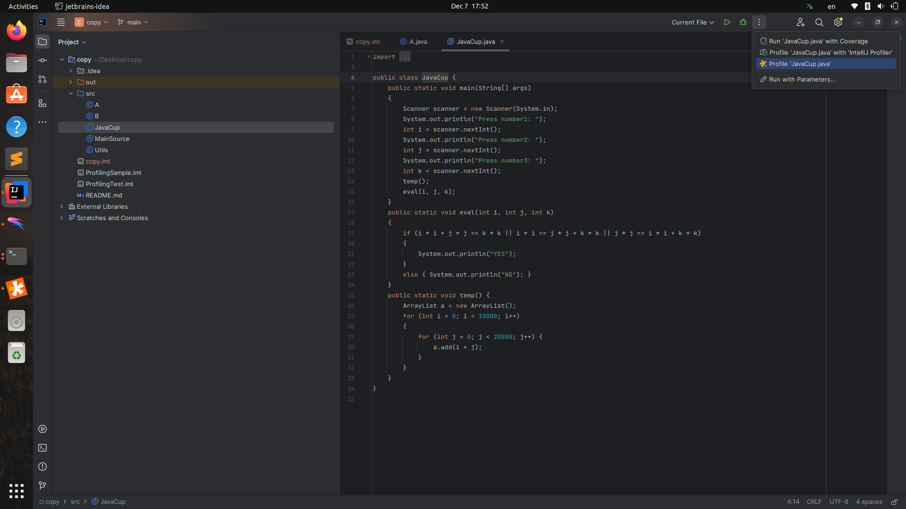

مشاهده میکنیم که نه تنها بخش temp حافظه و زمان اجرای بالایی دارد بلکه
میزان بالای مصرف حافظه آن سبب کرش کردن برنامه نیز می شود. 

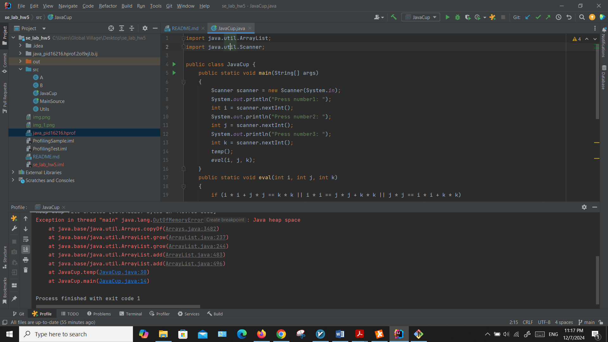

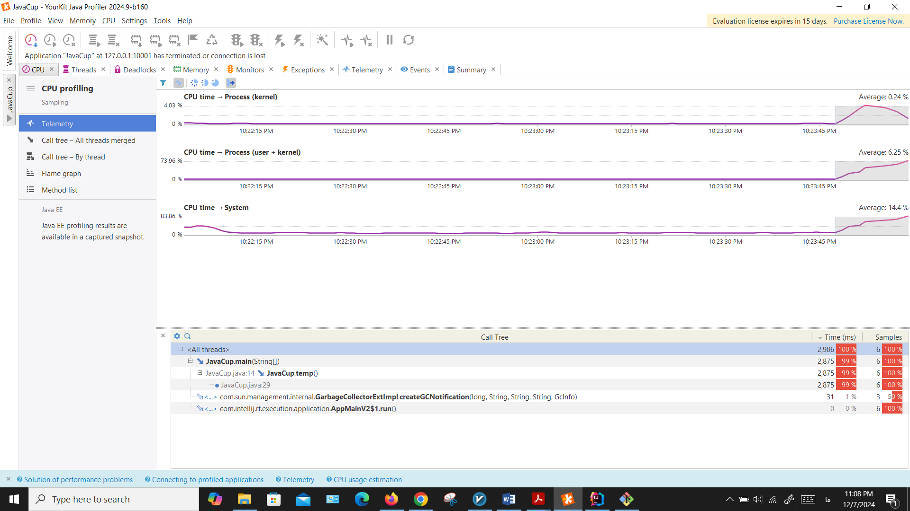

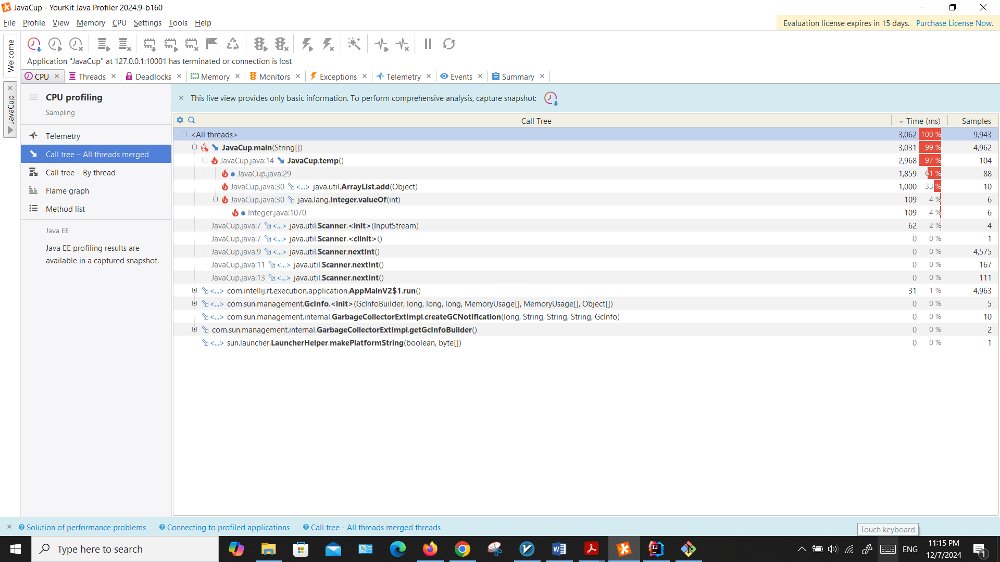

برای رفع این مشکل کافیست که ArrayList را با یک آرایه ساده جایگزین کنیم
چرا که هم سایز آرایه از قبل مشخص است هم ArrayList حجم بیشتری نسبت به
آرایه ساده می برد هم عملیات add به ArrayList عملیاتی زمان بر است:

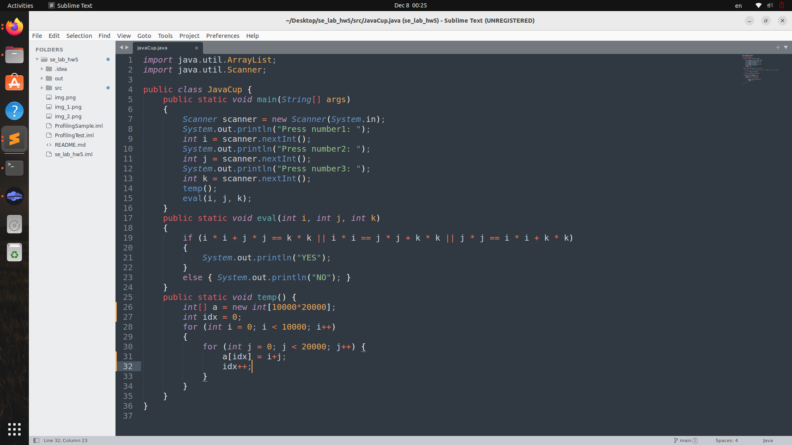

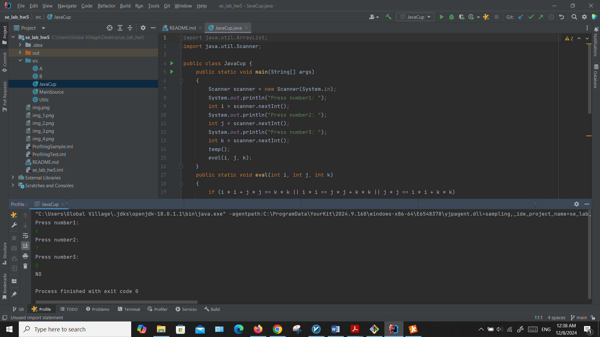

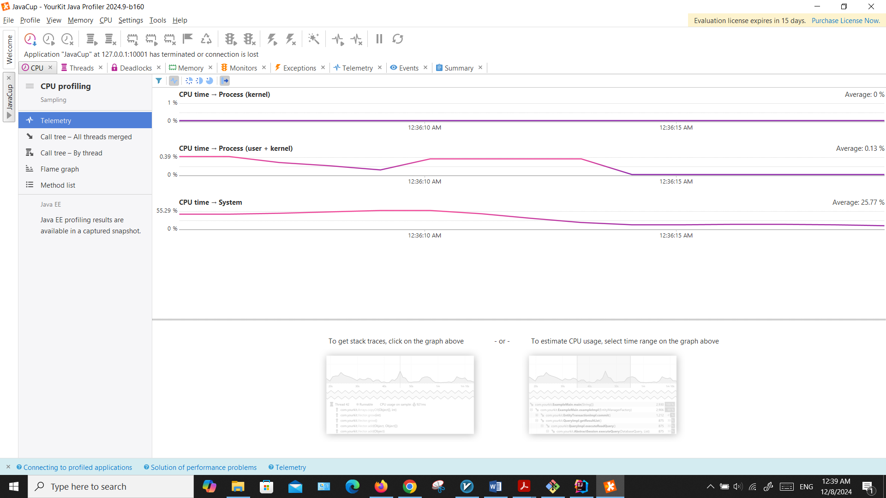

اکنون تابع زیر را اضافه میکنیم. تابع countDuplicatesBruteForce یک آرایه
دریافت کرده و تعداد عناصر تکراری آن را با دو حلقه روی آرایه میشمرد. این
الگوریتم از اردر n\^2 است و انتظار داریم که در ورودی های بزرگ برنامه به
bottleneck اصلی زمانی تبدیل شود. برای مطمئن شدن، برنامه را با کمک
yourkit تحلیل کرده و نتایج را بررسی میکنیم (نکته این که اینجا سعی شده
عناصر آرایه عناصری نیمه رندم باشند): 

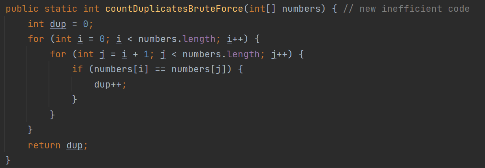

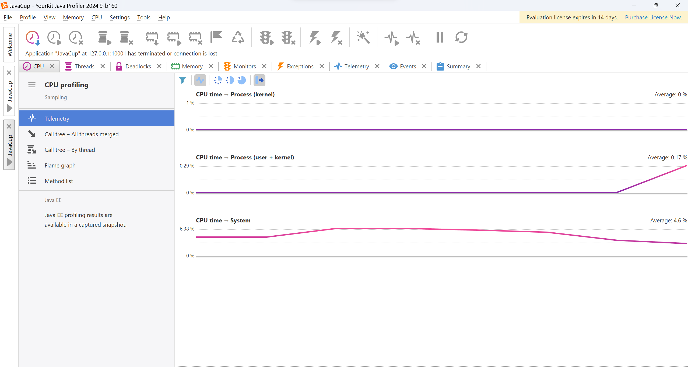

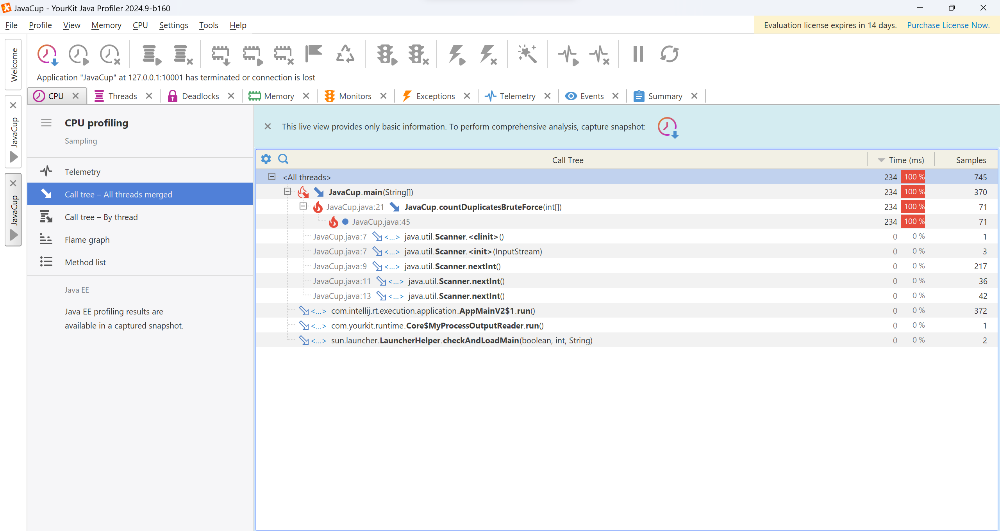

 طبق انتظار، مشاهده میکنیم که این تابع زمان زیادی از ما
میبرد.

اکنون سعی میکنیم تابع بهتری پیاده کنیم. با استفاده از HashMap مقادیر
آرایه را نگه میداریم و در صورت دیدن یک مقدار جدید آن را به مپ اضافه
میکنیم. این پیاده سازی اردر کمتری دارد (با تقریب خوبی (o(n است)‌ و انتظار
داریم که با اجرای برنامه و تست بهبودی در زمان اجرا داشته باشیم:
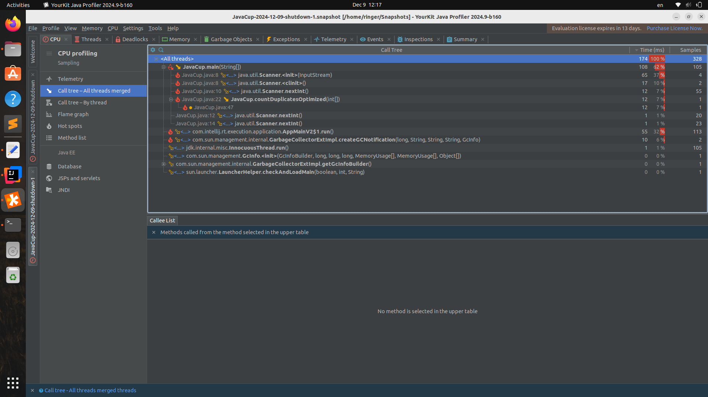 

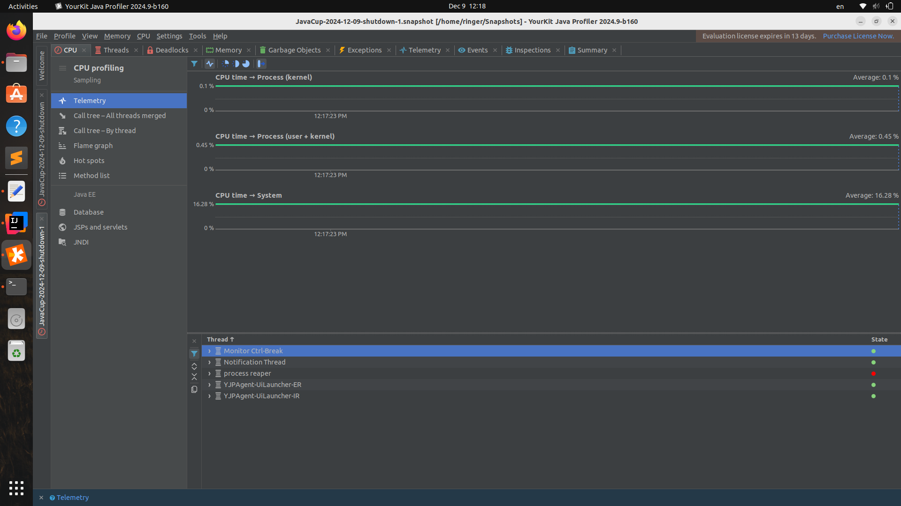 

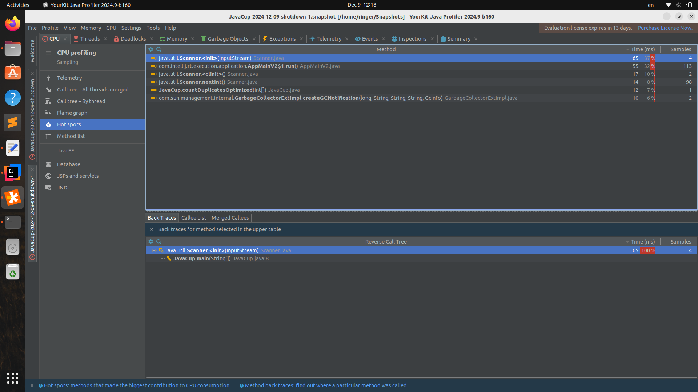

مشاهده میکنیم که نسبت به کد قبلی این تابع زمان اجرای بهتری دارد.
